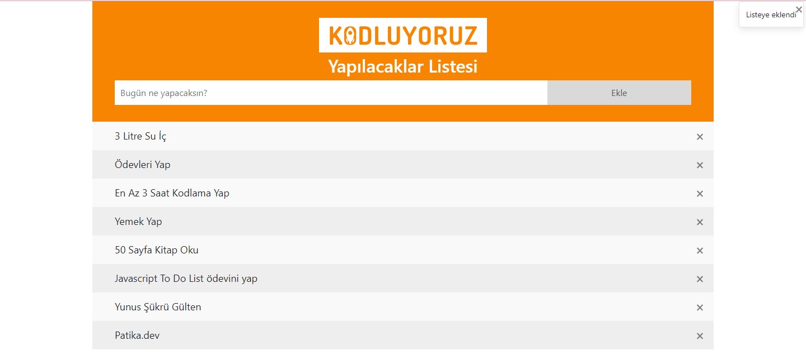

## JavascriptileToDoList
"What are you going to do today?" with JavaScript list.

## Patika.dev Account
[Yunus Şükrü Gülten](https://app.patika.dev/yunussukrugulten)

## Project Picture


## Installation
```bash
git clone https://github.com/yunussukrugulten/JavascriptileToDoList.git
```
## Usage
```linux
cd JavascriptileToDoList
code .
```

## License
[MIT](https://choosealicense.com/licenses/mit/)
